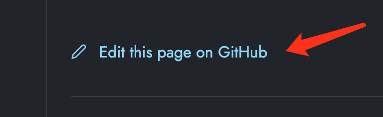

<div align="center">
<a href="https://github.com/Tencent-Cloud-Mesh/website">
    
</a>

<h1 align="center">
  TCM Website ☁️
</h1>

<h3 align="center">
  The Documents for Tencent Cloud Mesh.
  <a href="https://app.netlify.com/sites/tcmesh/deploys">
    
</a>
</h3>

<p align="center">
  TCM Website will give you some details about using Tencent Cloud Mesh, including a demo which can be run in TKE and managed by TCM
</p>

</div>

## Contribute

Thanks to the GitHub workflow and netlify, you can easily just edit or add the markdown files and give PRs by clicking the button in every pages. 📖



You do not need to rebuild the website with hugo and push it to GitHub, the CI/CD piplines will help you do everything. 😊

Also, You can have a local development of tcm website.

### 1. Clone Website

```bash
git clone https://github.com/Tencent-Cloud-Mesh/website.git 
```

### 2. Install dependencies

```bash
npm install
```

### 3. Start development server

```bash
npm run start
```

## Documentation

- [Netlify](https://docs.netlify.com/)
- [Hugo](https://gohugo.io/documentation/)
- [Doks](https://getdoks.org/)

## Communities

- [Netlify Community](https://community.netlify.com/)
- [Hugo Forums](https://discourse.gohugo.io/)
- [Doks Discussions](https://github.com/h-enk/doks/discussions)